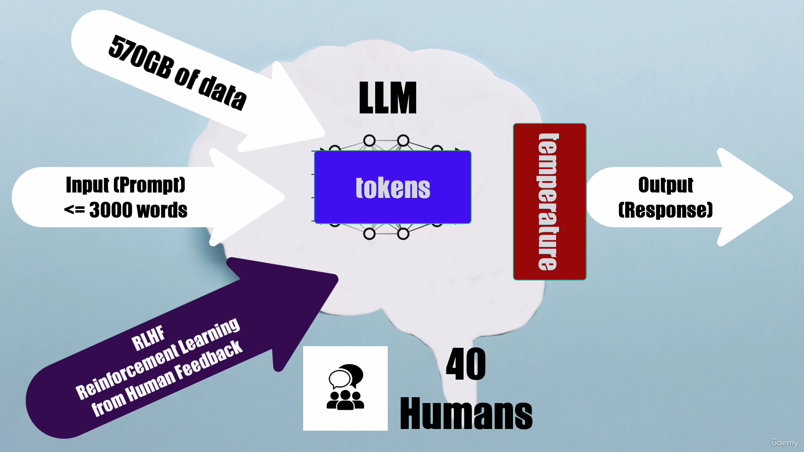

5. [ChatGPT Uncovered: A Beginners Guide](#5)

6. [Getting to know ChatGPT](#6)

7. [Under the Hood of ChatGPT](#7)

8. [Intimate Conversations with ChatGPT: Part 1](#8)

9. [Intimate Conversations with ChatGPT: Part 2](#9)

10. [More Exercises with ChatGPT](#10)

11. [Even more ChatGPT Ideas](#11)

12. [Artificial Intelligence: An Overview](#12)

---

## 5. ChatGPT Uncovered: A Beginners Guide<a id="5"></a>

- [Eliza](https://psych.fullerton.edu/mbirnbaum/psych101/eliza.htm): birth of chat bot
- [open ai](https://openai.com/): innovation

## 6. Getting to know ChatGPT<a id="6"></a>

- [chat gpt](https://chat.openai.com/auth/login): advance chat bot
  - use like google search engine
  - essay writing (intro background working conclusion)
  - recipe
  - remember context of our conversation (follow up)
  -

```txt
who was alan turing

write an essay about einstein

what is the recipe for carbonara sauce

what about a vegan one

```

## 7. Under the Hood of ChatGPT<a id="7"></a>

  
   
  
  
- LLM i.e large language model: a large neural network
- supervised learning: trained by internet language writing example by human
- RLHF Reinforcement learning from human feedback: punish and reward(dopamine) system trained by human
- [openai tokenizer](https://platform.openai.com/tokenizer)
```sh
the quick brown fox jump over the lazy dog
```

## 8. Intimate Conversations with ChatGPT: Part 1<a id="8"></a>

- go to [chat gpt](https://chat.openai.com/auth/login) create a new chat

temperature: how random chatgpt response are i.e output writings

```txt
what are your range of temperature

i mean the temperature value you use for prediction

list all the words at temperature 0.2 that you would follow "The quick brown with"

can you focus that to words that will immediately follow

what about temperature 0.8
```

<br>

Another chat

```txt
write a poem about elephant with the temperature set to 0.2

can you write another poem about elephant with temperature setting 0.8
```

## 9. Intimate Conversations with ChatGPT: Part 2<a id="9"></a>

Lets pretend we create first website like below and we want to check visitor response


```txt
we've created a prototype website for selling hydroponic equipment. now we need to test it with users. How we can effectively simulate user interaction and understand their thoughts

can you simulate a participant

can you imagine you are sarah using the website for the first time. how would you interact with it

what would sarah expect to see on the checkout page as method of payment?
```

<br>

Another chat

```txt
imagine you are a celebrity chef

imagine you are a french celebrity chef, give me a recipe for meringue

now imagine you are swiss. what would be recipe be?
```

## 10. More Exercises with ChatGPT<a id="10"></a>

Introduction:

ChatGPT is a powerful language model that can assist you in various tasks. This worksheet will guide you through different ways to interact with ChatGPT, including roleplaying, reviewing and improving a document, and writing a questionnaire.

### Exercise 1: Roleplaying

Roleplaying is a great way to practice real-life interactions with ChatGPT. Choose a scenario from the list below, and have a conversation with ChatGPT as if it were a relevant character or person. Take turns playing both sides of the conversation.

- Job Interview: You are the interviewer, and ChatGPT is the interviewee applying for a job.

- Customer Support: You are a frustrated customer, and ChatGPT is a customer support representative.

- Dating Profile: Create a fictional dating profile, and ChatGPT is another user interested in getting to know you.

- News Reporter: You are a news reporter, and ChatGPT is an expert you're interviewing about a recent event or topic.

An example of how prompts and responses might progress:

```txt
Student (Interviewer): Hello, thank you for coming in for this job interview. Can you please start by introducing yourself?

ChatGPT (Interviewee): Hello, I'm John Smith. I have a background in marketing and have worked in the field for five years. I'm excited about the opportunity to join your team.

Student (Interviewer): That's great, John. Could you tell me about a specific project or campaign you've worked on in the past that you're particularly proud of?

ChatGPT (Interviewee): Certainly! One project I'm proud of is a social media campaign I led for my previous employer. We managed to increase their online engagement by 30% in just three months by implementing a targeted content strategy.

Student (Interviewer): Impressive! Can you describe a challenging situation you've faced at work and how you handled it?

ChatGPT (Interviewee): Of course. There was a situation where we had a sudden budget cut in the middle of a project. I had to quickly reassess our priorities, negotiate with vendors, and find creative cost-saving solutions to ensure the project's success.

Student (Interviewer): That shows your adaptability, John. Now, can you explain why you're interested in joining our company specifically and how your skills align with our goals?

ChatGPT (Interviewee): I've done my research on your company, and I'm drawn to your innovative approach in the industry. I believe my experience in data-driven marketing and my ability to adapt to changing landscapes align perfectly with your company's focus on staying at the forefront of the market.
```

### Exercise 2: Review and Improve a Document

Upload a short document or piece of writing (a paragraph or two) that you've written or found online. Ask ChatGPT for feedback and suggestions on how to improve it. Follow these steps:

Upload your document using the chat interface.

Ask ChatGPT to review and provide feedback on the document.

Implement the suggested improvements and ask for clarification if needed.

Discuss the changes made and the reasoning behind them with ChatGPT.

### Exercise 3: Writing a Questionnaire

Imagine you are conducting a survey or gathering information on a specific topic. Create a questionnaire with 5-10 questions. Ask ChatGPT for assistance in generating questions that are clear, unbiased, and relevant to your topic. Follow these steps:

Provide a brief description of the topic and the purpose of your questionnaire.

Ask ChatGPT to help you come up with questions.

Review the questions for clarity and relevance.

Discuss any necessary revisions with ChatGPT.

Conclusion:

Interacting with ChatGPT can be a valuable learning experience. Whether you're practicing real-life conversations, seeking feedback on your writing, or creating a questionnaire, ChatGPT can assist you in various ways. Remember to use ChatGPT responsibly and ethically in your interactions.

## 11. Even more ChatGPT Ideas<a id="11"></a>

Try out these prompts to begin a conversation with ChatGPT:

1. "Tell me a fascinating fact about space exploration."

2. "Imagine you're a time traveler from the year 2050. What's the most significant change you've witnessed in the world?"

3. "If you could have dinner with any historical figure, who would it be and why?"

4. "What's your favorite book, and what lesson did you learn from it?"

5. "Describe your dream vacation destination, including all the activities you'd do there."

6. "If you could possess any superpower, what would it be, and how would you use it for good?"

7. "Share a personal anecdote or life lesson that has had a significant impact on you."

8. "What's the most exciting technological advancement you foresee in the next decade?"

9. "If you were to create a new holiday, what would it celebrate, and how would people observe it?"

10. "What's your favorite piece of artwork, and what emotions or thoughts does it evoke in you?"

---

```txt

An Example Chat
(when it gets a bit laborours search for ** nearer the end where I tell ChatGPT to give shorter answers)


Describe your dream vacation destination, including all the activities you'd do there.

ChatGPT
As an artificial intelligence language model, I don't have personal experiences, emotions, or the ability to dream or go on vacation. However, I can certainly help you describe a dream vacation destination and activities you might enjoy there based on popular travel preferences.

Dream Vacation Destination: Bora Bora, French Polynesia

Bora Bora is a picturesque island located in the South Pacific Ocean, known for its stunning natural beauty, crystal-clear turquoise waters, and overwater bungalows. Here's a description of my dream vacation in Bora Bora, including the activities I'd do:

Arrival and Overwater Bungalow: Upon arrival at Bora Bora's airport, I would be greeted with a traditional Polynesian welcome and transferred to my luxurious overwater bungalow. The thatched-roof bungalow would provide direct access to the lagoon, allowing me to wake up to the sound of gentle waves and breathtaking views.
Water Sports: Bora Bora is a water sports paradise, so I would start my days with activities like snorkeling in coral gardens to witness vibrant marine life, paddleboarding on the calm lagoon, and kayaking around the island's coastline.
Diving: For a deeper exploration of the underwater world, I'd go scuba diving. Bora Bora offers numerous dive sites, including the famous "Shark and Ray" dive, where I could swim alongside blacktip reef sharks and rays.
Island Exploration: I'd take a guided tour of the island to learn about its rich Polynesian culture and history. Visiting the local villages, meeting friendly residents, and sampling traditional Tahitian cuisine would be a must.
Romantic Sunset Cruise: One evening, I'd embark on a romantic sunset cruise. Sipping on cocktails while watching the sun dip below the horizon, with the iconic Mount Otemanu in the background, would be an unforgettable experience.
Relaxation and Spa: To unwind, I'd spend some time at the resort's world-class spa. Traditional Polynesian massages and treatments using natural ingredients like coconut oil and vanilla would rejuvenate my body and mind.
Hiking: I'd venture into the lush interior of the island and hike to the viewpoints for panoramic vistas of the island's rugged terrain, volcanic peaks, and the surrounding ocean.
Private Beach Picnic: I'd arrange for a private beach picnic, where I could enjoy a gourmet meal on a secluded stretch of white sand, complete with a personal butler and breathtaking views.
Stargazing: Bora Bora's remote location and limited light pollution make it an ideal spot for stargazing. I'd spend a night lying on the beach, identifying constellations, and marveling at the Milky Way.
Farewell Luau: To end my dream vacation, I'd attend a traditional Polynesian luau, complete with fire dancers, live music, and a feast of local delicacies.
Bora Bora's natural beauty, vibrant marine life, and the perfect blend of adventure and relaxation would make it an unforgettable dream vacation destination for anyone.


User
I'm into scuba.  What would I expect to see on a diving trip?

ChatGPT
Scuba diving in different locations around the world can offer a wide range of marine life and underwater landscapes to explore. What you can expect to see on a diving trip depends on the specific location you choose. However, here are some common underwater sights and marine life encounters that scuba divers often enjoy:

Coral Reefs: Coral reefs are some of the most biodiverse ecosystems on the planet. When diving in areas with healthy coral reefs, you can expect to see a stunning array of coral species in various shapes and colors. These reefs provide habitats for countless marine creatures.
Tropical Fish: In warm-water destinations like the Caribbean, the Maldives, and the Great Barrier Reef, you'll encounter a dazzling array of tropical fish species. Look out for colorful parrotfish, angelfish, clownfish, and schools of vibrant reef fish.
Sharks: Depending on the location, you might have the opportunity to encounter different species of sharks, including reef sharks, nurse sharks, and even larger species like tiger sharks and hammerhead sharks. Shark encounters are often a highlight for many divers.
Rays: Stingrays, manta rays, and eagle rays are often spotted on dives. These graceful creatures can be seen gliding through the water, sometimes in large groups.
Turtles: Sea turtles, such as green turtles and hawksbill turtles, are commonly encountered on dives. They are known for their gentle nature and can be seen feeding on seagrass or swimming gracefully through the water.
Eels: Moray eels and garden eels are fascinating to observe. Moray eels can often be found hiding in crevices or coral formations, while garden eels create colonies in sandy areas.
Cephalopods: Octopuses, squids, and cuttlefish are intelligent and elusive creatures that are a thrill to spot. They can change color and texture to camouflage themselves or communicate.
Macro Life: Many divers enjoy the world of macro photography, where you can find tiny and often bizarre creatures like nudibranchs, seahorses, pipefish, and various types of shrimp and crabs.
Wrecks: If you're into wreck diving, you can explore sunken ships, planes, and other artificial reefs. These sites often attract a wide variety of marine life, including large schools of fish.
Unique Ecosystems: Some diving destinations, like the Galapagos Islands or Komodo in Indonesia, offer unique ecosystems with encounters like swimming with marine iguanas, witnessing the mating dance of the mandarinfish, or diving alongside giant schools of fish in strong currents.
Remember that the underwater world is a delicate environment, and responsible diving practices are essential to protect the marine life and ecosystems you'll encounter. Always follow local regulations and guidelines to ensure a safe and sustainable diving experience.


User
I meant in Bora Bora

ChatGPT
Scuba diving in Bora Bora offers a unique underwater experience with a variety of marine life and underwater landscapes. While Bora Bora is not primarily known for its coral reefs like some other destinations, it still offers exciting diving opportunities. Here's what you can expect to see on a scuba diving trip in Bora Bora:

Sharks: Bora Bora is famous for its shark encounters. You can expect to see blacktip reef sharks and lemon sharks on many dives. There are also occasional sightings of grey reef sharks and nurse sharks. Shark dives are a popular attraction, and you can get up close and personal with these magnificent creatures.
Rays: Eagle rays and stingrays are commonly spotted during dives around Bora Bora. You might see them gracefully gliding through the clear waters, especially in areas like the "Shark and Ray" dive site.
Tropical Fish: While Bora Bora may not have the extensive coral reefs found in some other locations, you can still encounter a variety of tropical fish species. Look out for colorful parrotfish, triggerfish, butterflyfish, and damselfish.
Moray Eels: Moray eels are often found hiding in crevices and coral formations. These curious creatures are a common sight for divers exploring Bora Bora's underwater terrain.
Octopuses and Cuttlefish: Octopuses and cuttlefish, with their ability to change color and texture, can be fascinating to observe. They are often spotted during night dives.
Nudibranchs and Critters: Macro enthusiasts will enjoy searching for nudibranchs, shrimp, and other small critters. Bora Bora has its share of colorful and unique marine life for macro photographers.
Coral Gardens: While not as extensive as some other destinations, Bora Bora still has beautiful coral gardens with hard and soft corals. These areas provide habitats for smaller marine creatures and add to the overall underwater scenery.
Wrecks: There are a few shipwrecks around Bora Bora that divers can explore. These wrecks often attract schools of fish and other marine life.
Underwater Topography: Bora Bora's underwater topography includes canyons, swim-throughs, and dramatic drop-offs. These features create interesting dive sites and provide opportunities to see different types of marine life.
Night Dives: Night dives in Bora Bora can be magical, with the chance to see nocturnal creatures like octopuses, lobsters, and hunting lionfish.
Bora Bora's unique mix of shark encounters, rays, and other marine life, combined with its stunning underwater landscapes, makes it a memorable destination for scuba divers. The clear waters and the thrill of diving with sharks are often highlights of diving experiences in this tropical paradise.


User
Where would you recommend to stay on Bora Bora?

ChatGPT
Bora Bora offers a range of accommodation options, from luxury overwater bungalows to more budget-friendly choices. The best place to stay depends on your preferences, budget, and what you're looking for in your Bora Bora experience. Here are some recommendations for different types of travelers:

Luxury Resorts: If you're looking for a romantic and luxurious experience, Bora Bora is famous for its upscale overwater bungalows and private villas. Some of the top luxury resorts on the island include:
Four Seasons Resort Bora Bora: Known for its stunning overwater bungalows, excellent service, and beautiful lagoon views.
St. Regis Bora Bora Resort: Offers luxurious overwater villas with butler service, a fantastic spa, and a private lagoonarium for snorkeling.
Conrad Bora Bora Nui: Features spacious overwater bungalows, a hilltop spa, and various dining options.
Mid-Range Options: If you're seeking a balance between comfort and budget, there are some mid-range resorts and guesthouses on the island:
Le Maitai Polynesia Bora Bora: Offers comfortable accommodations, including overwater bungalows, and is located near the main town of Vaitape.
InterContinental Le Moana Bora Bora: Provides a more affordable option for overwater bungalows while maintaining a high level of service.
Budget Accommodations: While Bora Bora is known for its luxury, there are a few budget-friendly accommodations, such as:
Bora Bora Ecolodge: A guesthouse that offers a more affordable option for travelers. It provides a local experience and beautiful views.
Pension Alice et Raphael: Another guesthouse that provides a budget-friendly alternative with a welcoming atmosphere.
Private Rentals: Consider renting a private villa or vacation home if you prefer more independence and privacy. Websites like Airbnb and Vrbo have listings for Bora Bora.
Cruises: Some travelers opt for cruise vacations in French Polynesia, which often include stops in Bora Bora. These cruises offer a variety of onboard activities and excursions.
When choosing your accommodation in Bora Bora, keep in mind your budget, the type of experience you want, and whether you prefer staying in an overwater bungalow, beachfront villa, or a more traditional room. Additionally, consider the resort's location on the island, as some are more secluded, while others are closer to the main town of Vaitape, where you'll find restaurants and shops. Ultimately, Bora Bora offers a range of options to suit different preferences and budgets.


User
Do I need a visa?

ChatGPT
Whether or not you need a visa to visit Bora Bora or any other part of French Polynesia depends on your nationality and the purpose and duration of your visit. French Polynesia, including Bora Bora, is an overseas collectivity of France, so the visa requirements are generally aligned with those of France. Here are some general guidelines:

Visa-Exempt Travel: If you are a citizen of a European Union (EU) member country, the United States, Canada, Australia, New Zealand, or several other countries, you typically do not need a visa for short tourist visits to French Polynesia, including Bora Bora. Travelers from these countries can usually stay for up to 90 days within a 180-day period for tourism purposes without a visa.
Visa-Required Travel: If you are a citizen of a country not included in the visa-exempt list, you may need to apply for a Schengen visa (if you're traveling from a Schengen Area country) or a French visa (if you're traveling from a non-Schengen Area country) to enter French Polynesia. The specific visa requirements and application process can vary depending on your nationality and the nearest French embassy or consulate.
Passport Validity: Ensure that your passport is valid for at least six months beyond your planned departure date from French Polynesia.
Purpose of Visit: The type of visa you need can also depend on the purpose of your visit. Tourist visas are typically issued for leisure travel, while other types of visas are required for business, work, or longer-term stays.
Visa Extensions: If you plan to stay in French Polynesia for more than the allowed visa-free period, you may need to apply for a visa extension through the local authorities in French Polynesia.
It's essential to check the most up-to-date visa requirements and application procedures for your specific nationality by contacting the nearest French embassy or consulate or by visiting the official French government website. Visa regulations can change, so make sure to verify the requirements well in advance of your planned trip to Bora Bora or French Polynesia to ensure a smooth and hassle-free entry.

For the next chat, can you limit your answers to one paragraph each?

ChatGPT
Of course, I can provide shorter responses in one paragraph each. Please feel free to ask your questions or provide topics you'd like to discuss.


** When ChatGPT gives too much information........

User
Where in the world is the best place to SCUBA dive?

ChatGPT
The best place to SCUBA dive depends on your preferences and interests. Some popular destinations include the Great Barrier Reef in Australia for vibrant coral reefs and marine life, the Maldives for clear waters and diverse marine species, Palau for its unique underwater topography and biodiversity, and Indonesia for a mix of diving experiences across various islands. Ultimately, the best place for you will depend on factors like the type of marine life you want to see, your skill level, and your budget.


User
Which place is the best value for money?

ChatGPT
For a combination of excellent diving experiences and good value for money, Southeast Asia is often a top choice. Countries like Indonesia, Thailand, and Malaysia offer diverse underwater ecosystems, affordable dive packages, and a range of accommodation options to fit various budgets. Additionally, Egypt's Red Sea region is known for its affordability and spectacular diving sites. These destinations provide a great balance between quality diving and cost-effectiveness.


User
Oh!  What creatures can I see in the Red Sea?

ChatGPT
The Red Sea is teeming with a wide variety of marine life. Some of the creatures you can see while diving in the Red Sea include colorful coral formations, schools of fish such as barracuda, snapper, and surgeonfish, as well as larger species like reef sharks, dolphins, and even the occasional whale shark. You'll also encounter numerous species of reef fish, including angelfish, butterflyfish, and parrotfish, along with fascinating macro life like nudibranchs, seahorses, and various crustaceans. The Red Sea's warm, clear waters make it an excellent place for underwater photography and marine exploration.


User
Are any of them dangerous?

ChatGPT
While most of the marine life in the Red Sea is not dangerous to divers, there are a few species to be cautious of. Some reef sharks, like the oceanic whitetip and the occasional hammerhead shark, are present in the area but are generally not considered a significant threat to divers. Additionally, some species of jellyfish in the Red Sea can deliver painful stings, so it's essential to be aware of local conditions and take necessary precautions, such as wearing a wetsuit or skin suit for protection.

The most notable concern in the Red Sea is the presence of fire coral and lionfish. Fire coral can cause painful stings on contact, so it's crucial to avoid touching it. Lionfish, while not naturally aggressive, have venomous spines that can cause pain and discomfort if touched. However, with proper training and awareness, diving in the Red Sea is generally safe, and encounters with dangerous marine life are rare when following diving guidelines and respecting the environment.
```

## 12. Artificial Intelligence: An Overview<a id="12"></a>

Notice: Simulating human intelligence like nature of code by daniel shiffman


  


1. Robotics: think like giving life to metal circuit and code

- industrial robot
- driverless car

<br>
<br>

2. Planning: the ability of machine or system to set and achieve goal just like human

- gps route, best route on car

<br>
<br>

3. Vision: recognize, analyze and interpret visual data like photos, videos, diagrams, other visual information

- smart phone camera: it recognize faces, identifying objects, and even adjusting focus, face unlock,
- medical imaging, surveillance, autonomous vehicle

<br>
<br>

4. Speech: (COMMUNICATION) the ability of machile to understand and generate human speech, like complex sentences, idioms, sarcasm

- Alexa, siri

<br>
<br>

5. Expert system: specialists, trained to know everything there is to know about certain topic and use that knowledge to make informed decisions or solve complex problem

- lawyer:
- doctor: you type symptoms to perform diagnoses -traya
- finance to predict market
- engineering: to solve complex problem -pcb routing

<br>
<br>

6. NLP

- customer chat bot
- google search question

<br>
<br>

7. Machine learning: the science of getting computer to learn and act like humans and improve their learning over time

- chatgpt
- netflix series recommendation, based on past choice
- email spam detection
- twitter, instagram, youtube, discord, social media feed content showing, based on past choice
